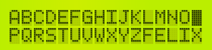

# fxLiquidCrystalJS

**Flexible LCD bargraph library for Arduino**


## Purpose


## Simple Example

```html
<canvas id="myCanvas" width="420" height="100"></canvas>
```

```js
const ldc = new fxLiquidCrystalJS("myCanvas")
lcd.init()
lcd.print("HELLO WORLD")
```


## Features

- 


## Screenshot




## Dependencies

None

## History

### 0.1.0
  - initial github commit
